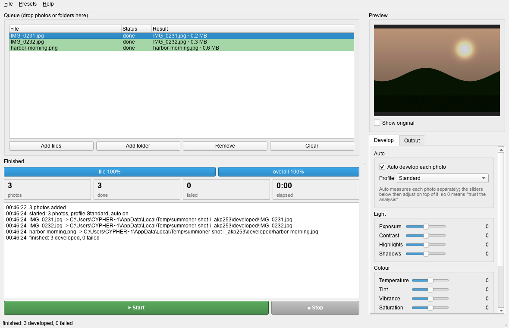

# summoner

Drop photos in, press **Start**, get developed photos — raw or JPEG, no catalogue, no import step.



## What it does

1. Decodes anything photographic: camera raw via libraw (tested on real CR2, CR3, NEF, ARW, RAF,
   ORF, RW2, PEF and X3F files) and JPEG/PNG/TIFF/WebP/BMP via Pillow. Nothing downloads;
   everything ships in the archive.
2. **Auto develop** measures every photo separately: white balance from the pixels that were
   plausibly grey, exposure with the bright end protected, and **local tone mapping** — a backlit
   face or a group in tree shade rises toward the midtone while the sky keeps its blue. Raw
   decodes also get the tone curve and colour the camera's JPEG engine would have applied. Night
   scenes, silhouettes and fog are detected and keep their darkness and mood. Calibrated against
   hundreds of real raws scored frame by frame against the camera's own JPEGs.
3. A **profile** (Standard, Portrait, Landscape, Vivid, Night, Black & white) shapes the look on top,
   and every slider adjusts on top of that, so 0 means "trust the analysis".
4. Saves JPEG (EXIF kept when the source had it), PNG, or 16-bit TIFF — written under a temporary
   name and moved into place only when complete. Originals are never touched.

```
your-photos/
  IMG_0231.CR2
  IMG_0232.CR2
  developed/          <- appears next to your photos (or wherever you point Output folder)
    IMG_0231.jpg
    IMG_0232.jpg
```

## Install

Grab a prebuilt binary from the [latest release](https://github.com/hclivess/summoner/releases/latest)
(Windows / Linux / macOS, no Python needed), or run from source:

```
pip install -r requirements.txt
python main.py            # GUI   (run.cmd / run.sh do the same)
```

No external tools required.

## Settings

| Tab | |
|---|---|
| **Develop** | Auto develop on/off, profile, then Light (exposure, contrast, highlights, shadows), Colour (temperature, tint, vibrance, saturation) and Detail (clarity, sharpen, denoise, vignette) |
| **Output** | Format (JPEG / PNG / TIFF 16-bit), JPEG quality, resize long edge, output folder |

**Presets** menu: Web JPEG (2048 px), Archive TIFF 16-bit, Quick black & white built in;
save / load / delete / import / export, *save current as defaults*, *reset*.

## CLI

```
python develop.py photos/ -o developed --profile Landscape
python develop.py IMG_0231.dng --no-auto --exposure 50 --shadows 30 --format "TIFF 16-bit"
```

## Tips

- Sky went grey in a sunset → auto white balance only corrects when it finds neutral pixels, so this
  should not happen; if a look is off, lower **Temperature** yourself or switch auto off.
- Subject still darker than you want → raise **Shadows**; it lifts the dark regions locally without
  touching the sky. **Exposure** moves the whole frame.
- A moody low-key shot came out too bright → auto holds back on night scenes and silhouettes, but
  taste differs; pull **Exposure** down or switch auto off for that batch.
- Night shots look smeared → lower **Denoise**; it trades detail for smoothness.
- Faces look crunchy → the **Portrait** profile softens clarity and sharpening.
- Output too large for mail → the **Web JPEG (2048 px)** preset.
- A photo failed → the queue row turns red with the reason; the rest of the queue still develops.

## Windows says the app is not safe

The Windows build is not code-signed, so SmartScreen shows *"Windows protected your PC — unknown publisher"* the
first time you run it. Nothing is wrong with the file; an unsigned executable from a small project has no
reputation with Microsoft.

- **To run it:** *More info* → *Run anyway*. From a downloaded `.zip` Windows also adds the mark-of-the-web:
  `Unblock-File .\summoner\*` in PowerShell clears it.
- **To verify the download:** every release ships a `.sha256` next to the archive; `Get-FileHash <archive>` must
  print the same digest.
- **If Defender quarantines it** rather than warning, that is a false positive on the PyInstaller runtime — report
  it at <https://www.microsoft.com/wdsi/filesubmission> and open an issue.

## Build

`pip install -r requirements.txt pyinstaller && python build.py` produces `dist/summoner-<version>-<os>-<arch>`.
The GitHub workflow builds all three platforms on every tag and attaches them to the release; the Linux build runs a
headless self-test (`SUMMONER_SELFTEST=<folder of photos>`) on the frozen binary against generated sample scenes.

## Changes in 1.2

Auto develop validated against an entire card: 263 real raws developed with zero failures and
scored frame by frame against the camera's own JPEGs, plus raw samples from nine other camera
makers (Canon CR2/CR3, Nikon NEF, Fujifilm RAF, Olympus ORF, Panasonic RW2, Pentax PEF, Sony ARW).

- Local tone mapping replaces the global-only lift: a dark subject rises toward the midtone while
  a bright sky's gain stays at 1 - backlit faces and groups in shade come out lifted, not murky.
- The exposure cap now targets the bright end at 0.80: a blue sky is no longer pushed to white.
- Night detection is gated on the bright end, so a shaded subject against a bright sky is treated
  as backlit (and lifted), never as a night scene (and left dark).
- A dominant bright sky no longer drags the whole frame darker; the shade fraction itself now
  drives shadow lift, so a small subject against a big sky is still rescued.
- The README screenshot is a real run on real, freely-licensed camera raws.

## Changes in 1.1

Auto develop rebuilt against real raws, benchmarked frame by frame against the camera's own JPEG
and a reference edit — 1.0's auto was dim and washed-out on raw files.

- Fixed the exposure unit bug: corrections were computed in gamma space but applied in linear
  light, landing ~2.2× weaker than intended. Raw output was chronically dimmer than the camera JPEG.
- The additive shadow lift washed photos milky; replaced with a multiplicative gamma lift that
  anchors true blacks, so night skies and silhouettes keep their depth.
- Raw decodes now get the tone curve and colour rendering the camera's JPEG engine would apply
  (JPEG input is left as shot); black point anchored decisively, levels measured post-exposure.
- Backlit scenes (shaded subject, bright background): the brightening the highlight cap refuses
  globally is now applied to the shadows, so faces under a tree come out lifted, not murky.

## Changes in 1.0

First release, built to the [hclivess house standard](https://github.com/hclivess/beautiful-software).

- Auto develop with per-photo analysis, six profiles, twelve manual sliders, live before/after preview.
- Raw via libraw/rawpy, bitmap via Pillow; JPEG / PNG / 16-bit TIFF out; EXIF preserved for JPEG sources.
- No catalogue and no database: a drag-and-drop queue, and a `developed/` folder next to your photos.
